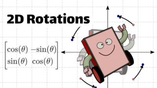

# Rotate 2D Matrix Project

## Overview
This project focuses on implementing an in-place algorithm to rotate an n x n 2D matrix by 90 degrees clockwise using the Python programming language. It requires a good understanding of matrix manipulation and in-place operations.

## Key Concepts
- Matrix Representation in Python: Understanding how 2D matrices are represented using lists of lists in Python.
- In-place Operations: Performing operations on data without creating a copy of the data structure.
- Matrix Transposition: Swapping rows and columns of a matrix.
- Reversing Rows in a Matrix: Manipulating rows by reversing their order.
- Nested Loops: Using nested loops to iterate through 2D matrices.

## Resources
- [Python Official Documentation](https://docs.python.org/3/): Data Structures, List Comprehensions, etc.
- [GeeksforGeeks Articles](https://www.geeksforgeeks.org/): Inplace rotate square matrix, Transpose a matrix in Single line, etc.
- [TutorialsPoint](https://www.tutorialspoint.com/python/): Python Lists for basics of list manipulation.

## Requirements
- Editors: vi, vim, emacs
- Interpretation/Compilation: Ubuntu 20.04 LTS using python3
- Code Style: pycodestyle version 2.8.0
- Documentation: All modules and functions must be documented

## Tasks
1. Rotate 2D Matrix (mandatory)
   - Rotate an n x n 2D matrix 90 degrees clockwise in-place.
   - Prototype: `def rotate_2d_matrix(matrix):`
   - Code should be executable and meet specified requirements.

## Repository Information
- [GitHub Repository: alx-interview](https://github.com/sabrallah/alx-interview/tree/master)
- [Directory: 0x07-rotate_2d_matrix](https://github.com/sabrallah/alx-interview/tree/master/0x07-rotate_2d_matrix)
- File: 0-rotate_2d_matrix.py

## Author
- Sabrallah Youssef (The Greatest of All Times) - [GitHub Profile](https://github.com/sabrallah)

## Important Dates
- Project Start: Feb 19, 2024, 4:00 AM
- Project End: Feb 23, 2024, 4:00 AM
- Checker Release: Feb 20, 2024, 4:00 AM

Copyright © 2024 ALX. All rights reserved.